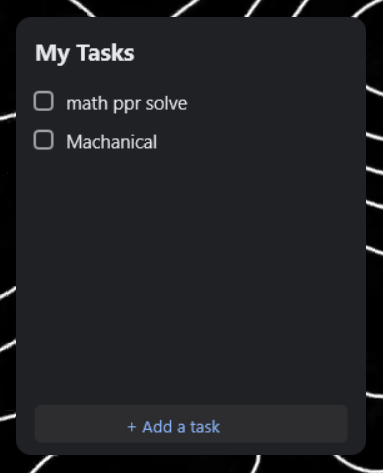

i was searching for a good todo widget for my pc for a long time can't find one so made this...

# Minimal Rainmeter To-Do List

A clean, optimized, and aesthetic To-Do list skin for Rainmeter.

Features dynamic task addition, Clean aesthetics and 0% CPU usage.

\## Features

\- ⚡ \*\*Zero Resource Usage:\*\* Updates only on interaction (`Update=-1`).

\- 🎨 \*\*Aesthetic:\*\* Dark mode, rounded corners, and vector graphics.

\- 🛠 \*\*Dynamic:\*\* Lua-backed for adding/deleting of tasks.

\- 🔒 \*\*Privacy:\*\* Local storage only.

\## Installation

1\. Install \[Rainmeter](https://www.rainmeter.net/).

2\. Clone this repo into `Documents\\Rainmeter\\Skins\\`.

3\. Refresh Rainmeter and load `ToDo.ini`.

